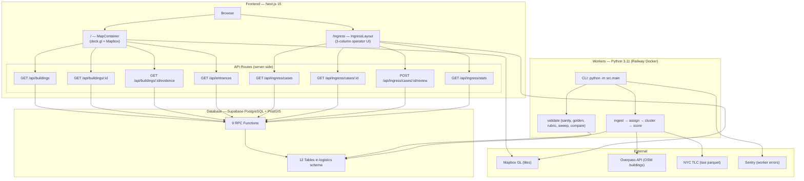

# CONTEXT_RECOVERY.md

Forensic audit performed 2026-08-22. Repo: `/Users/vaibhavh/navra`. Remote: `github.com/vaibhavhariram/curb.git`. Sole author: `vaibhavhariram`. 11 commits spanning 2026-03-13 to 2026-03-18. Last code touched: 2026-03-18 ~06:29 PDT. Five months cold.

---

## 1. TL;DR

NAVRA (aka "Logistics World Graph") is a geospatial analytics system that infers building entrance locations and delivery difficulty scores from NYC taxi trajectory data + OpenStreetMap footprints, targeting Manhattan. It has a Python data pipeline (ingest → cluster → score), a Next.js 15 map explorer, and validation tooling. The entire codebase was built in two sessions (~4 hours total) with heavy Claude Code assistance.

A complete operator workflow feature ("NAVRA Ingress" — 21 files, ~2500 LOC) sits fully implemented but **uncommitted** on branch `palantir-navra-ingress`. This is the most valuable uncommitted code in the repo.

There are zero tests, zero auth, zero CI. The project is a functional prototype, not production software.

**Resume at:** commit the Ingress feature, apply migration 009, run `refresh_ingress_cases()`, verify `/ingress` renders.

---

## 2. PRODUCT THESIS

| Aspect | Statement | Confidence |
|--------|-----------|------------|
| Problem | Last-mile delivery is hard because building entrances are ambiguous — GPS data is noisy and buildings have multiple potential access points | [INFERRED] — never stated explicitly; derived from domain model (entrance_candidates, difficulty scores, canonical_drop_points) |
| Target user | Logistics operators / analysts reviewing ambiguous building access points for delivery routing | [CONFIRMED] — `INGRESS-IMPLEMENTATION.md:7`: "operators work through a ranked queue of buildings where the system can't determine a clear access point" |
| Data source | NYC TLC taxi pickup/dropoff GPS traces as proxy for stop-event patterns | [CONFIRMED] — `README.md:3`: "Manhattan MVP using NYC TLC taxi data + OpenStreetMap building footprints" |
| Solution | Automated pipeline (DBSCAN clustering, composite difficulty scoring) + human-in-the-loop case review to produce canonical drop points | [CONFIRMED] — `INGRESS-IMPLEMENTATION.md:9`: "This turns the existing analytics pipeline into a decision system." |
| Differentiator | Converting noisy GPS trajectory data into structured, validated building access intelligence | [INFERRED] — no explicit competitive positioning anywhere |
| Business model | Not stated anywhere in the repo | [UNKNOWN] |
| Demo script closing line | "Every resolution becomes canonical truth for downstream routing. The queue is ranked by ambiguity so operators fix the hardest cases first." | [CONFIRMED] — `INGRESS-IMPLEMENTATION.md:234` |
| Project name confusion | Three names coexist: "NAVRA" (product brand in UI + branch names), "Logistics World Graph" (README, package.json, HTML title), "curb" (GitHub repo name) | [CONFIRMED] |

---

## 3. STACK & REPO MAP

| Path | Purpose | Language | LOC | Last Modified |
|------|---------|----------|-----|---------------|
| `web/` | Next.js 15 frontend (React 19, deck.gl 9, Mapbox GL, Tailwind 4, SWR 2) | TypeScript/TSX | ~1,800 | 2026-03-18 |
| `web/src/app/` | 2 page routes + 8 API route handlers | TypeScript | ~400 | 2026-03-18 |
| `web/src/components/` | 12 React components (3 map explorer + 9 ingress) | TSX | ~1,100 | 2026-03-18 |
| `web/src/lib/` | Supabase clients, SWR hooks (7), utility functions | TypeScript | ~300 | 2026-03-18 |
| `workers/` | Python 3.11 data pipeline (Dockerized for Railway) | Python | ~2,000 | 2026-03-18 |
| `workers/src/ingest/` | OSM building + NYC TLC stop ingestion + assignment | Python | ~500 | 2026-03-13 |
| `workers/src/cluster/` | DBSCAN entrance clustering | Python | ~250 | 2026-03-13 |
| `workers/src/score/` | Composite difficulty scoring | Python | ~200 | 2026-03-13 |
| `workers/src/validate/` | Golden sets, sanity checks, rubric scoring, sweeps, comparison | Python | ~700 | 2026-03-18 |
| `workers/src/common/` | Config, DB connection, job tracker, metrics | Python | ~350 | 2026-03-18 |
| `supabase/migrations/` | 9 SQL migrations (PostGIS schema, indexes, RPCs) | SQL | ~770 | 2026-03-18 |
| `*.md` (root) | README, CLAUDE.md, IMPLEMENTATION_REVIEW, INGRESS-IMPLEMENTATION, SPEC-1 | Markdown | ~1,500 | 2026-03-18 |

**Total:** ~12,200 LOC across 81 source files. `node_modules` exists (deps installed). No Python venv present.

---

## 4. ARCHITECTURE

### Runtime Diagram



### Key Architectural Decisions

1. **Dual DB access pattern.** Web uses Supabase client SDK → PostgreSQL RPC functions. Workers use direct psycopg2 connections. All business logic lives in SQL RPCs — API route handlers are thin passthroughs. [CONFIRMED] — every route handler in `web/src/app/api/` calls exactly one RPC.

2. **All spatial data in EPSG:4326 (WGS84).** Workers transform to EPSG:32618 (UTM Zone 18N) for metric computations (DBSCAN distance, area calculations), then store results back as 4326. [CONFIRMED] — `workers/src/cluster/dbscan.py` uses `pyproj.Transformer`.

3. **SWR for all client-side data fetching.** Seven hooks with deduplication intervals, conditional fetching (entrances only at zoom ≥ 16), and auto-refresh (stats every 30s). [CONFIRMED] — `web/src/lib/hooks/`.

4. **Pipeline is sequential CLI.** No queue, no scheduler, no async workers. Run manually: `ingest-buildings` → `ingest-stops` → `assign` → `cluster` → `score`. Jobs tracked in `pipeline_jobs` table for idempotency. [CONFIRMED] — `workers/src/main.py`.

5. **No auth.** All 8 API endpoints are fully public, including the write endpoint (`POST /api/ingress/cases/:id/review`). Clerk keys exist in `.env.local.example` but are never imported or referenced in code. [CONFIRMED].

---

## 5. DATA MODEL

### Entity-Relationship Overview

```
buildings (1) ──< (N) building_stop_events >── (1) stop_events
buildings (1) ──< (N) entrance_candidates
buildings (1) ──< (N) building_scores
buildings (1) ──< (N) building_validation_notes
buildings (1) ──  (1) golden_buildings
buildings (1) ──< (N) building_rubric_scores
buildings (1) ──  (1) ingress_cases
ingress_cases (1) ──< (N) operator_reviews
buildings (1) ──< (N) canonical_drop_points
operator_reviews (1) ──  (1) canonical_drop_points.source_review_id
ingress_cases.recommended_candidate_id ──> entrance_candidates
operator_reviews.selected_candidate_id ──> entrance_candidates
```

### Tables (12 total)

**Core Pipeline:**

| Table | Key Columns | Purpose |
|-------|-------------|---------|
| `logistics.buildings` | id, osm_id (UNIQUE), name, address, building_type, footprint (POLYGON 4326), centroid (GENERATED), area_sqm, perimeter_m | Manhattan building footprints from OSM |
| `logistics.stop_events` | id, source_id, event_type ('pickup'/'dropoff'), location (POINT 4326), event_timestamp, dwell_seconds, passenger_count, source_dataset, batch_id | NYC TLC taxi stop events |
| `logistics.building_stop_events` | building_id (FK), stop_event_id (FK), distance_m; UNIQUE(building_id, stop_event_id) | Junction: which stops assigned to which buildings |
| `logistics.entrance_candidates` | building_id (FK), location (POINT 4326), cluster_size, avg_dwell_sec, stddev_position, confidence (0-1), side (N/S/E/W), snap_to_edge (POINT, **always NULL**), pipeline_run_id | DBSCAN-derived entrance locations |
| `logistics.building_scores` | building_id (FK), difficulty (0-1), stop_variance, road_distance, entrance_count, dwell_time, sample_size, pipeline_run_id; UNIQUE(building_id, pipeline_run_id) | Composite delivery difficulty scores |
| `logistics.pipeline_jobs` | id (UUID), job_type, status, params (JSONB), started_at, completed_at, error, stats (JSONB) | Pipeline execution tracking |

**Validation Tooling:**

| Table | Key Columns | Purpose |
|-------|-------------|---------|
| `logistics.building_validation_notes` | building_id (FK), pipeline_run_id, status ('plausible'/'wrong_building'/'diffuse_cluster'/'good_candidate'/'needs_tuning'), note | Free-form validation annotations |
| `logistics.golden_buildings` | building_id (PK FK), reason | Curated set for manual evaluation |
| `logistics.building_rubric_scores` | building_id (FK), pipeline_run_id, assignment_quality (0-3), entrance_plausibility (0-3), score_usefulness (0-3), note; UNIQUE(building_id, pipeline_run_id) | Structured quality rubric |

**Ingress (uncommitted — migration 009):**

| Table | Key Columns | Purpose |
|-------|-------------|---------|
| `logistics.ingress_cases` | building_id (FK UNIQUE), ambiguity_score (0-1), review_status ('pending'/'resolved'/'skipped'), cluster_type, candidate_count, evidence_summary (JSONB), recommended_candidate_id (FK) | Buildings needing human review |
| `logistics.operator_reviews` | case_id (FK), selected_candidate_id (FK), resolution_type ('canonicalized'/'wrong_building'/'diffuse_cluster'/'ambiguous_entrance'/'skip'), note | Operator decisions |
| `logistics.canonical_drop_points` | building_id (FK), location (POINT 4326), source_review_id (FK), confidence (0-1), active (BOOLEAN) | Validated entrance locations — the pipeline's output |

### Key RPC Functions (9 total)

| Function | Type | Purpose |
|----------|------|---------|
| `get_buildings_in_bbox(bbox, score_range, limit)` | SQL STABLE | GeoJSON FeatureCollection for map viewport |
| `get_building(p_id)` | SQL STABLE | Single building with score + entrances |
| `get_entrances_in_bbox(bbox, limit)` | SQL STABLE | GeoJSON entrance candidates for map |
| `get_building_evidence(p_building_id)` | SQL STABLE | Full debug payload (stops, entrances, scores, notes) |
| `get_building_evidence_extended(p_building_id, p_pipeline_run_id)` | SQL STABLE | Multi-run evidence (defined in migration 008, **never called from frontend**) |
| `refresh_ingress_cases()` | PL/pgSQL | Re-generates pending cases. Ambiguity formula: `0.4*difficulty + 0.35*(1-max_conf) + 0.25*(1-conf_gap)`. Filters: difficulty > 0.4, ≥ 2 candidates, max_conf < 0.7 OR conf_gap < 0.2 |
| `get_ingress_cases(p_limit)` | SQL STABLE | Queue: pending first, then by ambiguity DESC |
| `get_ingress_case_detail(p_case_id)` | SQL STABLE | Full case payload (building, score, entrances, stops limit 200, reviews, canonical point) |
| `submit_ingress_review(case_id, resolution_type, candidate_id, note)` | PL/pgSQL | Transactional: inserts review, updates case, creates/replaces canonical_drop_point |
| `get_ingress_stats()` | SQL STABLE | Aggregate counts + avg ambiguity |

### Indexes (26 total)

GIST spatial: buildings.footprint, buildings.centroid, stop_events.location, entrance_candidates.location, canonical_drop_points.location. B-tree on all foreign keys, plus: stop_events.event_timestamp, stop_events.batch_id, building_scores.difficulty, ingress_cases.review_status, ingress_cases.ambiguity_score DESC, canonical_drop_points.active (partial WHERE active=true).

---

## 6. FEATURE INVENTORY

| Feature | State | Evidence | What's Missing |
|---------|-------|----------|----------------|
| Building footprint ingestion (OSM) | WORKING | `workers/src/ingest/buildings.py` | — |
| Stop event ingestion (NYC TLC parquet) | WORKING | `workers/src/ingest/stops.py` | — |
| Stop-to-building assignment (ST_DWithin) | WORKING | `workers/src/ingest/stops.py:run_assign_stops` | — |
| DBSCAN entrance clustering | WORKING | `workers/src/cluster/dbscan.py` | — |
| Difficulty scoring (4-component composite) | WORKING | `workers/src/score/compute.py` | — |
| Pipeline job tracking | WORKING | `workers/src/common/job_tracker.py` | — |
| Pipeline metrics/observability | WORKING | `workers/src/common/metrics.py` | — |
| Map explorer (/ page, deck.gl + Mapbox) | WORKING | `web/src/app/page.tsx`, `web/src/components/map/MapContainer.tsx` | — |
| Evidence inspector panel | WORKING | `web/src/components/panels/EvidencePanel.tsx` | — |
| Buildings API (bbox query) | WORKING | `web/src/app/api/buildings/route.ts` | — |
| Entrances API (bbox query) | WORKING | `web/src/app/api/entrances/route.ts` | — |
| Building detail API | WORKING | `web/src/app/api/buildings/[id]/route.ts` | — |
| Evidence API | WORKING | `web/src/app/api/buildings/[id]/evidence/route.ts` | — |
| Validation: golden buildings | WORKING | `workers/src/validate/golden.py` (CLI only) | No frontend UI |
| Validation: sanity checks | WORKING | `workers/src/validate/sanity.py` (CLI only) | No frontend UI |
| Validation: rubric scoring | WORKING | `workers/src/validate/rubric.py` (CLI only) | No frontend UI |
| Validation: parameter sweeps | WORKING | `workers/src/validate/sweep.py` (CLI only) | No frontend UI |
| Validation: run comparison | WORKING | `workers/src/validate/compare.py` (CLI only) | No frontend UI |
| Ingress: database schema (3 tables, 5 RPCs) | PARTIAL | `supabase/migrations/009_ingress_tables.sql` (untracked) | Migration not applied to DB |
| Ingress: API layer (4 routes) | PARTIAL | `web/src/app/api/ingress/` (untracked) | Not committed, not deployed |
| Ingress: data hooks (4 SWR hooks) | PARTIAL | `web/src/lib/hooks/useIngress*.ts` (untracked) | Not committed |
| Ingress: 3-column operator UI (9 components) | PARTIAL | `web/src/components/ingress/` (untracked) | Not committed |
| Ingress: keyboard shortcuts (j/k/Enter/Esc) | PLANNED-ONLY | `INGRESS-IMPLEMENTATION.md:201` — "stretch goal" | Not implemented |
| Ingress: URL state sync (?case=123) | PLANNED-ONLY | `INGRESS-IMPLEMENTATION.md:202` — "stretch goal" | Not implemented |
| Entrance snapping (snap_to_edge) | STUBBED | `003_create_tables.sql:50` — column exists, always NULL | No computation logic in workers |
| Authentication (Clerk) | STUBBED | `.env.local.example` has keys | Zero imports, no middleware, no auth checks |
| Analytics (PostHog) | STUBBED | `.env.local.example` has keys | Zero imports, no tracking |
| Web error tracking (Sentry) | STUBBED | `.env.local.example` has DSN | Not wired in web (only Python workers) |
| Validation notes creation | DEAD | Table exists, EvidencePanel renders them | No write API — read-only display of empty data |
| Multi-run score UI | DEAD | `get_building_evidence_extended` RPC exists (migration 008) | Never called from frontend |
| `useBuilding` hook | DEAD | `web/src/lib/hooks/useBuilding.ts` | Exported, never imported |
| Browser Supabase client | DEAD | `web/src/lib/supabase/client.ts` | Exported, never imported |
| `ambiguityToRGBA` utility | DEAD | `web/src/lib/utils/colors.ts` | Exported, never imported |
| Automated tests | ABSENT | — | Zero test files, no framework, no CI |
| API rate limiting | ABSENT | — | All endpoints fully open |
| Data export (CSV/GeoJSON) | ABSENT | — | No export functionality |
| Mobile responsive layout | ABSENT | — | Dark-mode desktop only |

---

## 7. INTEGRATIONS & CONFIG

| Service | Status | SDK/Import | Env Var(s) | Used Where |
|---------|--------|------------|------------|------------|
| **Supabase** (PostgreSQL + PostGIS) | ACTIVE | `@supabase/ssr` (web), `psycopg2` (workers) | `NEXT_PUBLIC_SUPABASE_URL`, `NEXT_PUBLIC_SUPABASE_ANON_KEY`, `DATABASE_URL` | All API routes, all worker modules |
| **Mapbox** | ACTIVE | `mapbox-gl`, `react-map-gl`, `deck.gl` | `NEXT_PUBLIC_MAPBOX_TOKEN` | MapContainer, IngressMap |
| **OpenStreetMap Overpass API** | ACTIVE | `requests` (HTTP) | None (hardcoded URL) | `workers/src/ingest/buildings.py` |
| **NYC TLC** | ACTIVE | `pandas.read_parquet` | None (hardcoded CloudFront URL) | `workers/src/ingest/stops.py` |
| **Sentry** (workers only) | ACTIVE | `sentry-sdk` | `SENTRY_DSN` | `workers/src/main.py` |
| **scikit-learn** | ACTIVE | `sklearn.cluster.DBSCAN` | None | `workers/src/cluster/dbscan.py` |
| **Clerk** (auth) | DEAD | Not imported anywhere | `NEXT_PUBLIC_CLERK_PUBLISHABLE_KEY`, `CLERK_SECRET_KEY` | Nowhere |
| **PostHog** (analytics) | DEAD | Not imported anywhere | `NEXT_PUBLIC_POSTHOG_KEY`, `NEXT_PUBLIC_POSTHOG_HOST` | Nowhere |
| **Sentry** (web) | DEAD | Not imported in web | `SENTRY_DSN` (in web .env.example) | Nowhere in web |

**Env var audit:** 5 of 9 variables in `web/.env.local.example` are dead config. No `.env` or `.env.local` file exists in the working tree (correctly gitignored).

---

## 8. WORK TIMELINE

| Session | Date | Duration | Commits | Theme | AI Co-author |
|---------|------|----------|---------|-------|--------------|
| 1a | 2026-03-13 18:37 PDT | ~2h | 1 | GitHub initial commit + `feat/mvp-foundation` branch: full PostGIS schema, Python workers, Next.js frontend — 15,868 lines in one commit | None listed |
| 1b | 2026-03-13 21:56 PDT | ~1h | 1 | `feat/pipeline-observability` branch: parallel rebuild with evidence panel, validation notes, metrics — 8,638 lines. This became the canonical trunk. | Claude Opus 4.6 |
| 2 | 2026-03-18 05:20–05:57 PDT | ~37min | 7 | Validation tooling (golden set, rubric, sweeps, comparison), extended RPC, .gitignore fix, README docs, IMPLEMENTATION_REVIEW.md | Claude Haiku 4.5 |
| 2+ | 2026-03-18 06:14–06:29 PDT | ~15min | 0 (uncommitted) | **NAVRA Ingress**: full operator workflow — 19 new files, 1 modified file, ~2500 LOC. Complete but never committed. | [INFERRED] Claude (given speed and branch name) |

**Total active development time:** < 4 hours.

**Abandoned work:** Branch `feat/mvp-foundation` (`b351431`) was an earlier scaffold attempt with a different component architecture (`BuildingDetail.tsx` + `ScoreBreakdown.tsx` instead of `EvidencePanel.tsx`). It was pushed to remote but superseded by `feat/pipeline-observability`. Never merged to main.

**Remote state:** Only `origin/main` (README-only, 1 commit behind local) and `origin/feat/mvp-foundation` exist on remote. The canonical development branch `feat/pipeline-observability` and the current `palantir-navra-ingress` were never pushed.

---

## 9. IN-FLIGHT WORK

### The Last Coherent Unit: NAVRA Ingress

Branch `palantir-navra-ingress` contains the complete, uncommitted Ingress feature. The branch name's "palantir" prefix and the existence of a 3-minute demo script in `INGRESS-IMPLEMENTATION.md` suggest this was being prepared for an external demo or pitch.

**Uncommitted changes (21 files):**

| Category | Files | State |
|----------|-------|-------|
| Planning docs | `INGRESS-IMPLEMENTATION.md` (262 lines), `SPEC-1.md` (225 lines) | Untracked |
| Database migration | `supabase/migrations/009_ingress_tables.sql` (3 tables, 5 RPCs, ~350 lines) | Untracked |
| API routes | 4 files in `web/src/app/api/ingress/` | Untracked |
| React components | 9 files in `web/src/components/ingress/` | Untracked |
| SWR hooks | 4 files in `web/src/lib/hooks/useIngress*.ts` | Untracked |
| Modified: migration cleanup | `supabase/migrations/007_validation_tooling.sql` — removed 90 lines of duplicated `get_building_evidence_extended` (already in 008) | Unstaged |
| Modified: color utility | `web/src/lib/utils/colors.ts` — added `ambiguityToRGBA()` function | Unstaged |

**Completion assessment:** The implementation matches the plan in `INGRESS-IMPLEMENTATION.md` exactly. `SPEC-1.md` confirms "TypeScript: clean (npx tsc --noEmit passes)" and "Next.js production build: passes." This is a "forgot to commit" state, not a "mid-implementation" state.

**One anomaly:** `ambiguityToRGBA()` in `colors.ts` is defined but never imported by any Ingress component. The `IngressMap.tsx` imports `confidenceToRGBA` and `eventTypeColor` but not `ambiguityToRGBA`. Likely intended for future use (e.g., coloring queue items by ambiguity). [CONFIRMED] — grep shows zero imports of `ambiguityToRGBA`.

### No stashes.

---

## 10. OPEN THREADS

### TODOs / Unfinished Items

The codebase itself contains **zero TODO/FIXME/HACK/WIP markers**. All open threads are documented in planning files:

| Thread | Source | Status |
|--------|--------|--------|
| Commit + push the Ingress feature | Implicit — 21 uncommitted files | Blocking everything |
| Apply migration 009 to Supabase | `SPEC-1.md:222` — "all API routes registered as dynamic server endpoints" but migration not applied | Blocking Ingress runtime |
| Run `refresh_ingress_cases()` to populate case queue | `INGRESS-IMPLEMENTATION.md:176` | Blocking Ingress demo |
| Push `feat/pipeline-observability` to remote | Branch exists locally but has no upstream | Not blocking but significant — this is the canonical development history |
| Keyboard shortcuts (j/k/Enter/Esc) for Ingress | `INGRESS-IMPLEMENTATION.md:201` | Stretch goal, not started |
| URL state sync (?case=123) for Ingress | `INGRESS-IMPLEMENTATION.md:202` | Stretch goal, not started |
| Optimistic UI on review submit | `INGRESS-IMPLEMENTATION.md:203` | Deferred — using cache invalidation instead |
| `snap_to_edge` computation | `003_create_tables.sql:50` — column exists | No logic anywhere |
| Clerk auth integration | `.env.local.example` — keys defined | Zero code written |
| PostHog analytics integration | `.env.local.example` — keys defined | Zero code written |
| Sentry web integration | `.env.local.example` — DSN defined | Zero code written (workers only) |
| Validation notes creation UI/API | Table exists, panel renders them | Read-only, no write path |
| Multi-run score comparison in frontend | `get_building_evidence_extended` RPC exists | Frontend only uses `get_building_evidence` |
| Frontend rubric scoring | Currently CLI-only | `IMPLEMENTATION_REVIEW.md:412` |
| Sweep results visualization | Currently CLI-only | `IMPLEMENTATION_REVIEW.md:413` |
| Export as CSV/GeoJSON | Not started | `IMPLEMENTATION_REVIEW.md:415` |
| Automated test suite | Zero tests exist | `IMPLEMENTATION_REVIEW.md:417` |
| API rate limiting | All endpoints open | `IMPLEMENTATION_REVIEW.md:418` |
| Mobile responsiveness | Desktop-only, dark mode only | `IMPLEMENTATION_REVIEW.md:421` |

---

## 11. RISKS & ROT

### Security

| Risk | Severity | Evidence |
|------|----------|----------|
| **All API endpoints are unauthenticated** | CRITICAL | Zero auth checks in any of 8 route handlers. The POST review endpoint allows anonymous writes to the database. |
| **No rate limiting** | HIGH | Any endpoint can be called without throttling |
| **Supabase anon key used server-side** | MEDIUM | `web/src/lib/supabase/server.ts` — uses `NEXT_PUBLIC_SUPABASE_ANON_KEY` for server client instead of a service role key. RLS policy status unknown. |
| **No CORS configuration** | LOW | Next.js API routes default to same-origin, but no explicit CORS headers |

### Committed Secrets

No live credentials found in committed code. The `.env.local.example` and `.env.example` files contain placeholder patterns (`xxxx`, `pk_test_xxx`, `sk_test_xxx`), not real keys. `.env` and `.env.local` are gitignored. [CONFIRMED]

### Staleness

| Concern | Detail |
|---------|--------|
| Last commit: 2026-03-18 | 5 months ago. Dependencies may have security patches. |
| `node_modules` present | Installed ~5 months ago. No `npm audit` run. |
| No Python venv | Workers can't run without setting one up. |
| No lockfile for Python | `requirements.txt` has no pinned versions — builds are not reproducible. |
| `feat/mvp-foundation` branch abandoned | 15,868 LOC of dead code on remote. Confusing for anyone else who clones. |

### Dead Code

| Item | File |
|------|------|
| `useBuilding` hook | `web/src/lib/hooks/useBuilding.ts` — never imported |
| Browser Supabase client | `web/src/lib/supabase/client.ts` — never imported |
| `ambiguityToRGBA` function | `web/src/lib/utils/colors.ts` — never imported |
| `get_building_evidence_extended` RPC | `supabase/migrations/008_update_evidence_rpc.sql` — never called from frontend |

### Missing Infrastructure

No CI/CD (no `.github/workflows/`, no Vercel config, no Railway pipeline config beyond workers `railway.toml`). No linting configured (eslint is not in devDependencies). No pre-commit hooks. No Dockerfile for web.

---

## 12. UNKNOWNS

Ranked by how much they'd unblock progress:

1. **Has migration 009 ever been applied to the Supabase instance?** — If not, the Ingress feature can't run. If yes, the `refresh_ingress_cases()` may or may not have been called. The database state is unknown.

2. **Is there a live Supabase project with data?** — The pipeline ingests real NYC TLC data and OSM footprints. Unknown whether `ingest-buildings` and `ingest-stops` have ever been run against the real database, or if the database is empty.

3. **What was the "Palantir" context?** — The branch name `palantir-navra-ingress` implies an external audience. Was this for a job application, a partnership demo, a Palantir-hosted hackathon, or something else? The 3-minute demo script suggests a live presentation.

4. **Why three project names?** — "NAVRA" vs "Logistics World Graph" vs "curb" (GitHub repo). Is NAVRA the company/product and LWG the project? Is "curb" the original name that was abandoned?

5. **Why was `feat/mvp-foundation` rebuilt from scratch?** — Session 1 produced two parallel implementations of the same system on different branches, both from main. The second (`feat/pipeline-observability`) superseded the first. Was this intentional (different AI session, different approach) or accidental?

6. **What deployment target is intended?** — Web on Vercel? Workers on Railway (railway.toml exists)? Are these actually configured or just aspirational?

7. **Is there real data worth preserving?** — If the pipeline has run, the database may contain valuable computed results (entrance candidates, difficulty scores, golden building annotations) that took time to generate.

8. **What's the intended auth model?** — Clerk keys are in env.example. Is this for multi-operator access control, or just to gate the tool behind a login? What roles were planned?

---

## 13. RESUME OPTIONS

### (a) Smallest step to get it running

**Commit the Ingress feature and verify the existing stack.**

1. `git add` all 21 untracked/modified files on `palantir-navra-ingress` and commit.
2. Push the branch (and `feat/pipeline-observability`) to remote.
3. Check if `web/.env.local` exists or needs to be created from `.env.local.example` with real Supabase + Mapbox credentials.
4. `cd web && npm run dev` — verify `/` (map) and `/ingress` render.
5. Apply migration 009 to Supabase: `supabase db push` or run the SQL manually.
6. Call `SELECT logistics.refresh_ingress_cases()` to populate the case queue.
7. Verify `/ingress` shows cases (requires the pipeline to have run at least once).

**Effort:** 30 minutes if credentials exist and database has data. 2-4 hours if the pipeline needs to be run from scratch (setting up Python venv, running ingest-buildings, ingest-stops, assign, cluster, score).

**Depends on:** Supabase project existing and accessible, Mapbox token valid, database either having data or willingness to run the pipeline.

### (b) Obvious next feature: authentication + deployment

The project has no auth and no deployment pipeline. Given the branch name suggests an external demo:

1. Wire up Clerk auth (keys already in env example):
   - Add `@clerk/nextjs` dependency
   - Create `middleware.ts` protecting `/ingress` and POST endpoints
   - Add `<ClerkProvider>` to root layout
   - Pass user identity to `submit_ingress_review` for audit trail
2. Deploy web to Vercel (add `NEXT_PUBLIC_*` env vars)
3. Deploy workers to Railway (already has `railway.toml` + Dockerfile)
4. Set up a basic GitHub Actions CI: typecheck + build

**Effort:** 4-8 hours for auth + deploy. Another 2-4 hours for CI.

**Depends on:** Decision on auth model (who should have access), Vercel/Railway accounts, DNS/domain if desired.

### (c) The honest case for abandoning or pivoting

This project is a well-executed prototype of a narrow thesis: taxi GPS data can reveal building entrance patterns. But:

- **The data proxy is weak.** Taxi pickups/dropoffs are a noisy signal for delivery access points. Taxis stop at curbs; delivery drivers use loading docks, service entrances, and lobbies. The correlation may not generalize.
- **The competitive moat is thin.** Google Maps, Mapbox, and HERE already have entrance data derived from Street View imagery, contributor data, and commercial fleet telemetry. A taxi-data approach would need to prove superiority or complementarity.
- **The "decision system" needs real operators.** Without users generating reviews, the canonical_drop_points table stays empty and the system produces nothing beyond what the pipeline already computes.
- **Zero tests, zero auth, zero CI** — standard tech debt for a prototype, but substantial work to productionize.
- **5 months cold** — context is lost, dependencies are stale, and momentum is gone.

If the thesis is still believed in, the Ingress UI is a strong demo artifact. If not, the architectural patterns (PostGIS + deck.gl + case-queue workflow) are reusable for other geospatial decision-support tools.

---

## 14. PORTABLE CONTEXT BLOCK

NAVRA is a geospatial analytics prototype built in March 2026 by a solo developer (vaibhavhariram, Berkeley email) with heavy Claude Code AI assistance. The GitHub repo is named "curb" but the product is called "NAVRA" with a working title of "Logistics World Graph."

**What it does:** Takes NYC taxi pickup/dropoff GPS data and OpenStreetMap building footprints for Manhattan, then runs a pipeline: (1) ingest building polygons from OSM Overpass API, (2) ingest taxi stop events from NYC TLC parquet files, (3) assign stops to nearest buildings within 50m, (4) cluster assigned stops using DBSCAN to identify likely entrance locations, (5) compute a composite delivery difficulty score (stop variance, road distance, entrance count, dwell time — equal weights, percentile normalized). The result is a scored map of Manhattan buildings with inferred entrance points.

**The "Ingress" feature** adds a human-in-the-loop decision workflow: buildings where the system can't determine a clear entrance (high difficulty, multiple candidates, low confidence) are surfaced as "ingress cases" ranked by an ambiguity score. Operators review them through a three-panel UI — case queue on the left, a deck.gl map in the center, and an evidence/action panel on the right — and either canonicalize an entrance point, flag the building as problematic, or skip it. Resolved cases produce "canonical drop points" intended as ground truth for downstream routing.

**Tech stack:** Next.js 15 (React 19, TypeScript) frontend with deck.gl and Mapbox GL for visualization, SWR for data fetching, Tailwind CSS 4. Python 3.11 CLI workers for the data pipeline (psycopg2, pandas, scikit-learn DBSCAN, pyproj, Shapely). Supabase PostgreSQL with PostGIS for spatial storage and RPC-based business logic (9 SQL functions). All API route handlers are thin wrappers around Supabase RPCs.

**Current state:** The core pipeline and map explorer are committed and functional. Validation tooling (golden building sets, rubric scoring, parameter sweeps, run comparison) is committed and works via CLI. The Ingress operator workflow is fully implemented (~2500 LOC, 21 files) but sits uncommitted on a branch called "palantir-navra-ingress." The build was verified passing per the developer's notes.

**What's missing:** Zero automated tests. Zero authentication (all 8 API endpoints are public, including a write endpoint for submitting operator reviews). Zero CI/CD. Clerk auth keys are in the env example but never integrated. No deployment configuration beyond a Railway Dockerfile for the Python workers. The database schema column `snap_to_edge` on entrance candidates is defined but never populated. Five months of staleness since last touch.

**Key numbers:** ~12,200 LOC across 81 files. 12 database tables, 26 indexes, 9 RPC functions. 8 API endpoints. 2 frontend routes. 14 CLI commands. 11 git commits total. Entire project built in approximately 4 hours of active development across 2 sessions.

**The core question for anyone resuming:** Is the thesis that taxi GPS data reveals building entrance patterns valid enough to invest further? The infrastructure is solid for a prototype — the pipeline works, the visualization is complete, the operator workflowCan y is built. But there's a gap between "impressive demo" and "useful product," and the project stopped right at that boundary.

---

*Report generated 2026-08-22 by forensic audit. Every factual claim is tagged [CONFIRMED] with file evidence, [INFERRED] with reasoning, or [UNKNOWN] per the conventions in this document. The scratch file `.audit-notes.md` in the repo root contains working notes from this audit.*
